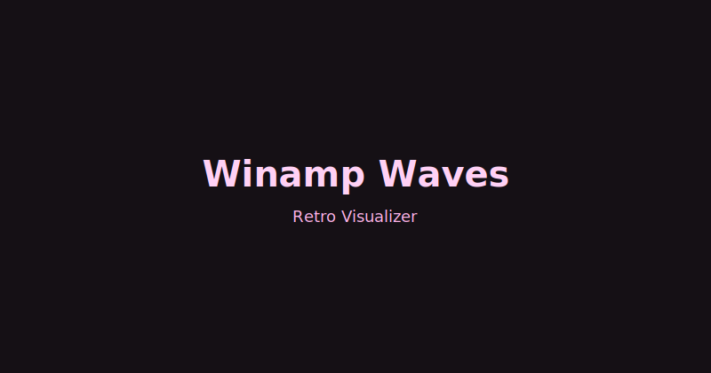
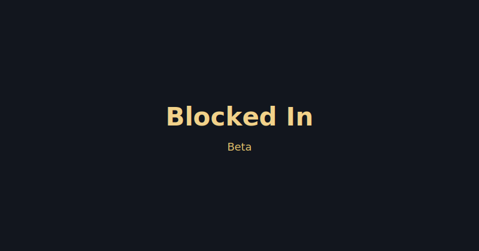
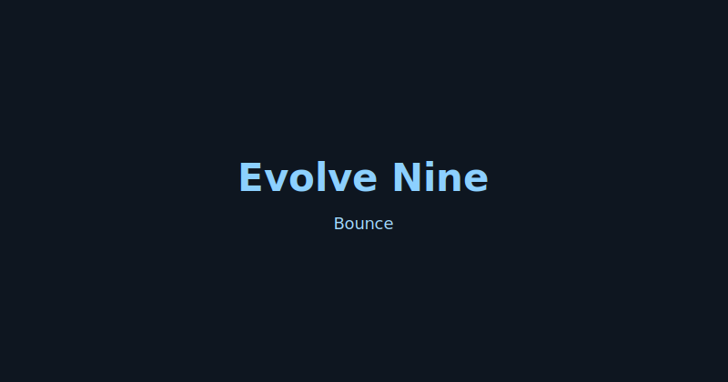

# RedefineIt

Experiments with interactive multimedia using JS and Canvas

## Project Thumbnails

<table>
  <tr>
    <td align="center">
       Fibonacci — Shell
    </td>
    <td align="center">
       Fibonacci Remix — Shell
    </td>
    <td align="center">
       Canvas Fern
    </td>
  </tr>
  <tr>
    <td align="center">
       Winamp Waves
    </td>
    <td align="center">
       Blocked In (Beta)
    </td>
    <td align="center">
       Evolve Nine Bounce
    </td>
  </tr>
  <tr>
    <td align="center">
       Frequency Spinner
    </td>
    <td align="center">
       Sudoku
    </td>
    <td align="center">
       Sphere Vortex
    </td>
  </tr>
  <tr>
    <td align="center">
       Wave Anim Generator
    </td>
    <td align="center">
       Enochian — Magic Square
    </td>
  </tr>
</table>

### 🧱 Bricked In

https://redefineit.net/BrickedIn.html

------

### 🏠 Home

https://redefineit.net/

------

### 🌌 Sphere Vortex

https://redefineit.net/sphere-vortex/dist/index.html

------

### 🎛️ Frequency Spinner

https://redefineit.net/frequency-spinner/dist/index.html

------

### 🔢 Sudoku

https://redefineit.net/sodoku/dist/index.html

## Warp Waves

https://redefineit.net/winamp-waves/

https://redefineit.net/winamp-waves/v1.html  
https://redefineit.net/winamp-waves/v2.html  
https://redefineit.net/winamp-waves/v3.html  
https://redefineit.net/winamp-waves/v4.html  
https://redefineit.net/winamp-waves/v5.html  
https://redefineit.net/winamp-waves/v6.html  
https://redefineit.net/winamp-waves/v7.html  
https://redefineit.net/winamp-waves/v8.html  
https://redefineit.net/winamp-waves/v9.html  
https://redefineit.net/winamp-waves/v10.html  
https://redefineit.net/winamp-waves/v11.html  
https://redefineit.net/winamp-waves/v12.html

https://redefineit.net/winamp-waves/13thfoor.html  

**The Fibonacci Spiral** is a geometric representation derived from the Fibonacci sequence — a series where each number equals the sum of its two predecessors (1, 1, 2, 3, 5, 8, 13, 21…). When plotted as quarter-circle arcs inside a grid of adjoining squares whose side lengths follow this sequence, the resulting curve approximates the **golden spiral**, which expands by a constant factor of **φ ≈ 1.618** — the **golden ratio**.

This ratio emerges naturally in recursive growth systems and optimization patterns throughout biology, from sunflower seed arrangements to nautilus shells and pinecones. In computational geometry and generative art, the Fibonacci spiral serves as a framework for **golden-angle phyllotaxis**, **fractal modeling**, and **parametric growth algorithms**. Its logarithmic curvature can be expressed mathematically as:
$$
r = a e^{b\theta}
$$
